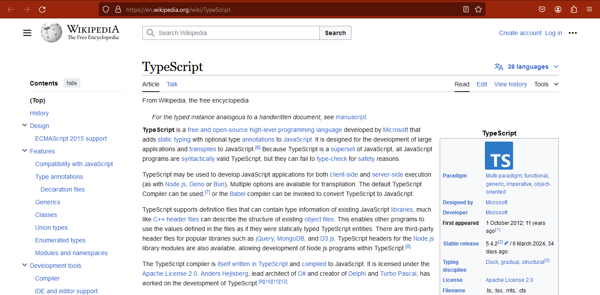

## Laporan Praktikum

|  | Pemrograman Berbasis Framework 2024 |
|--|--|
| NIM |  2141720153|
| Nama |  Muhammad Fahmi Huwaidi |
| Kelas | TI - 3I |

### Jawaban Soal 1

Bukti setup environment telah berhasil di  komputer.

 

### Jawaban Soal 2

Here's a paraphrase of the text:

**Behind the Scenes of Your Project**

This explains what different folders and files do in a project, like a behind-the-scenes guide. 

* **Project History (.git):** This hidden folder keeps track of all changes made to the project over time. 
* **External Building Blocks (node_modules):** This folder stores pre-built code from others that your project uses to function.
* **Public Showcase (public):** This folder contains files like images and HTML that people can see when they visit your project on the web.
* **Project Core (src):** This folder holds the main code you wrote to make your project work. It might have subfolders for different parts of the project.
* **Code Checkup Tool (.eslintrc.json):** This file helps find errors or areas to improve your code.
* **Ignored Files (.gitignore):** This file tells Git to ignore certain files, like temporary build files or secret information, so they don't get saved in project history.
* **Next.js Configuration (next.config.mjs):** This file lets you adjust settings for a framework called Next.js if you're using it for your project.
* **TypeScript Definitions (next-env.d.ts):** This file helps TypeScript understand code from other sources.
* **Project Details (package.json):** This file contains information about your project, like its name, version, and required code from others.
* **Dependency Lock (package-lock.json):** This file helps make sure everyone using the project gets the exact same external code.
* **CSS Processing Setup (postcss.config.js):** This file controls how a tool transforms your CSS code.
* **Project Instructions (README.md):** This file is like a manual for your project, explaining how to use it or get started.
* **Tailwind CSS Customization (tailwind.config.js):** This file lets you change how a CSS framework called Tailwind CSS works in your project.
* **TypeScript Configuration (tsconfig.json):** This file tells TypeScript how to compile your code. 

### Jawaban Soal 3

Bukti setup environment telah berhasil di  komputer.

Contoh perubahan.
1. **Change a File:**  When you modify a file, it gets removed from the temporary storage used by the front-end (build cache).
2. **Webpack Steps In:** Webpack then reloads your main application file (root.jsx).
3. **Cache Cleanup:** As it reloads root.jsx, Webpack also clears the cache for any files that depended on the changed file. This cleanup continues through "parent" files (files that used the changed file) and even "grandparent" files (files that used the parent files).
4. **The Root of It All:** This chain reaction stops at your main application file (root.jsx). This ensures all related files get reloaded when you make changes.
